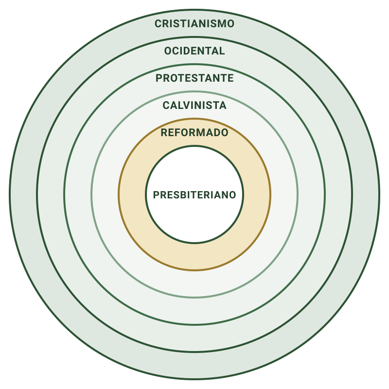

## 1. Abertura

No Censo de 2022, **26,9%** dos brasileiros com 10 anos ou mais se declararam evangélicos. Na classificação divulgada com os microdados, a categoria *evangélica não determinada* passou de **4,8% para 15,6%**. Ela reúne quem respondeu apenas "evangélica", "crente" ou "protestante", sem dizer a que igreja pertence.

Parte desse salto vem do método. Em 2010, o recenseador era orientado a perguntar "qual igreja?"; em 2022, as respostas genéricas foram registradas como vieram. Isso não prova que as pessoas perderam sua identidade denominacional. Mostra que **a identidade ficou mais difícil de medir**, e talvez também de nomear. O Censo mede autodeclaração, não conhecimento doutrinário nem convicção.

Daí a pergunta que abre a série:

**O que significa ser presbiteriano?** Conseguimos responder sem dizer apenas que nascemos nessa igreja?

## 2. A ordem bíblica

> "Mas, ainda que venhais a sofrer por causa da justiça, bem-aventurados sois. Não vos amedronteis, portanto, com as suas ameaças, nem fiqueis alarmados; antes, **santificai a Cristo, como Senhor, em vosso coração**, estando sempre preparados para **responder** a todo aquele que vos pedir **razão da esperança** que há em vós, fazendo-o, todavia, **com mansidão e temor, com boa consciência**, de modo que, naquilo em que falam contra vós outros, fiquem envergonhados os que difamam o vosso bom procedimento em Cristo."
>
> 1 Pedro 3.14-16, Almeida Revista e Atualizada

Pedro escreve a cristãos que viviam como "peregrinos e forasteiros" (1Pe 2.11). Eram difamados como malfeitores (2.12) e estranhados por antigos companheiros por causa da mudança de vida (4.3-4). O sofrimento em vista é sobretudo hostilidade social, suspeita e calúnia.

### A ordem do texto

Pedro não começa pela técnica de argumentação. Ele começa pelo medo e termina no modo e na vida de quem responde:

1. **Não se deixar governar pelas ameaças.**
2. **Santificar Cristo como Senhor no coração**, reconhecendo-o como aquele que ocupa o lugar decisivo de lealdade, confiança e temor.
3. **Estar preparado para explicar a esperança.** Não é ter resposta técnica para toda pergunta, e sim saber explicar a esperança quando ela se torna visível e é questionada.
4. **Responder com mansidão, temor e boa consciência.** Isso faz parte da própria defesa: uma resposta agressiva contradiz a esperança que pretende explicar, e uma vida incoerente entrega aos acusadores o argumento.

**Não é saber tudo. É saber em quem esperamos.**

### Dois freios de Calvino

> "Pedro, aqui, não nos ordena a estarmos preparados para a solução de qualquer questão que porventura esteja em debate; pois não é dever de todos discutirem qualquer tema. Mas, o que está em pauta é **a doutrina geral, a qual pertence ao não instruído e ao simples**."
>
> João Calvino, Comentário a 1 Pedro 3.15

> "A menos que nossa mente seja dotada com mansidão, as contendas se irromperão imediatamente. E **mansidão é posta em oposição a orgulho e vã ostentação**, bem como a zelo excessivo."
>
> João Calvino, Comentário a 1 Pedro 3.16

**Nem especialista, nem orgulhoso.** Pedro não transforma todo cristão em especialista. Ele chama todo cristão a conhecer o centro da sua fé e a não usar a verdade como licença para orgulho ou disputa.

## 3. Por que confessar a fé

### "Sou apenas cristão"

A frase expressa uma lealdade correta: nossa identidade final está em Cristo. Mas ela não elimina a necessidade de interpretar a Bíblia. **Todo cristão interpreta a Bíblia de alguma forma**: relaciona textos, escolhe o que é central e tira conclusões para o culto, a igreja e a vida.

A pergunta, então, não é *se* teremos uma síntese da fé, mas: **nossa síntese será pública, examinável e subordinada à Escritura?**

### Irineu e a regra da fé

> "A Igreja espalhada pelo mundo inteiro até os confins da terra **recebeu dos apóstolos** e seus discípulos a fé em um só Deus, Pai onipotente [...] em um só Jesus Cristo, Filho de Deus, encarnado para nossa salvação; e no Espírito Santo."
>
> Irineu de Lião, Contra as Heresias I.10.1, cerca de 180

Contra grupos que alegavam possuir ensinos secretos, Irineu lembra que a igreja recebeu e ensinava publicamente **um núcleo da fé, com estrutura trinitária**: a [[regra-da-fe|regra da fé]]. Ela ainda não é um [[credo]] com redação fixa, mas já tem conteúdo reconhecível.

[[credo|Credos]] e [[confissao-de-fe|confissões]] não substituem a Bíblia. Eles tornam público como a igreja entende o ensino bíblico.

## 4. Além do TULIP

### Cânones de Dort (1618-1619)

Os [[canones-de-dort|Cânones de Dort]] foram a resposta a **cinco artigos em disputa nos Países Baixos**, apresentados pelos [[remonstrantes]]. A resposta se organiza em: eleição · morte de Cristo · corrupção e conversão · perseverança. Daí vêm os "cinco pontos", conhecidos pelo acróstico [[tulip|TULIP]].

O próprio documento se apresenta como resposta a uma controvérsia específica, não como sistema completo:

> "Esta é a declaração clara, simples e sincera da doutrina ortodoxa com respeito aos **Cinco Artigos de Fé disputados na Holanda**; e esta é a rejeição dos erros pelos quais as Igrejas têm sido perturbadas, por algum tempo."
>
> Cânones de Dort, Conclusão, 1619

### Westminster: 33 capítulos

A [[confissao-de-fe-de-westminster|Confissão de Fé de Westminster]] trata de muito mais que os cinco pontos:

| Área | Temas |
|---|---|
| Fundamento | Escritura, Trindade, criação, providência, [[alianca\|aliança]] |
| Salvação | Mediador, justificação, adoção, santificação |
| Vida cristã | Lei, liberdade de consciência, culto, casamento |
| Igreja | Sacramentos, batismo, Ceia, concílios |
| Consumação | Ressurreição e juízo final |

### O lugar do TULIP

- Resume uma resposta sobre a salvação ([[soteriologia]]).
- Não define sozinho o calvinismo.
- "Reformado" é doutrina, culto, sacramentos, igreja, governo e vida.

**Dá para conhecer os cinco pontos e conhecer muito pouco da tradição reformada.**

## 5. Os seis círculos

Para enxergar o conjunto, a série usa seis círculos como mapa de trabalho, de fora para dentro. **Cada círculo interno conserva tudo o que o externo afirma e acrescenta uma pergunta.** Ninguém deixa de ser cristão ao se tornar presbiteriano; apenas responde a mais perguntas. Nem todo cristão é ocidental, nem todo ocidental é protestante, e assim por diante.

| Círculo | O que designa | O que pergunta |
|---|---|---|
| Cristianismo | Fé histórica no Deus triúno, centrada em Jesus Cristo e no evangelho apostólico, expressa nos credos antigos. | Quem é Deus? Quem é Cristo? |
| [[cristianismo-ocidental\|Ocidental]] | Tradição latina, herdeira sobretudo de Agostinho, que pôs pecado, graça e salvação no centro do debate e formou as perguntas que a Reforma retomou. | Qual o peso do pecado e da graça? |
| [[protestante\|Protestante]] | Famílias nascidas da Reforma, que afirmam a autoridade suprema das Escrituras e a justificação pela fé. | Qual a autoridade? Como somos justificados? |
| [[calvinista\|Calvinista]] | Maneira de ver toda a realidade diante da glória e da soberania de Deus, não apenas a salvação. | Como tudo se ordena para a glória de Deus? |
| [[reformado\|Reformado]] | Forma confessional e eclesial dessa herança: confissões públicas, culto, sacramentos, aliança e disciplina. | Como confessamos, adoramos e vivemos? |
| [[presbiteriano\|Presbiteriano]] | Ramo reformado governado por [[presbitero\|presbíteros]] reunidos em [[concilio\|concílios]] que se conectam e prestam contas. | Quem governa? Como as igrejas prestam contas? |

Este é um **mapa didático** da série, não uma classificação oficial. Muitos autores usam *calvinista* e *reformado* como sinônimos, e o diagrama não decide sozinho quem é ou não é ortodoxo. Cada círculo será aprofundado nas próximas aulas.

**Calvinismo não é apenas uma teoria sobre a ordem da salvação. É uma maneira de compreender toda a realidade diante da glória e da soberania de Deus.** O presbiterianismo é uma expressão histórica, confessional e eclesial dessa herança.

## 6. Fechamento

> "Mas se formos **ignorantes da doutrina e da glória de Cristo, quem dentre nós estaria disposto a sofrer por sua causa?** [...] A negligência da catequização é, portanto, uma das principais causas porque há tantos nos dias de hoje agitados por todo vento de doutrina."
>
> Zacarias Ursino, Comentário do Catecismo de Heidelberg, I, p. 95

Ursino não liga a ignorância a uma nota baixa. Ele a liga à **incapacidade de permanecer firme quando a fé é pressionada**, e é por isso que o fechamento volta a 1 Pedro.

### As aulas da série

A série percorre três movimentos: **os fundamentos que confessamos**, **a história de sua formulação** e **comparações com tradições que encontramos**. Veja o [programa completo da série](../).

### Leitura final

> "Antes, **santificai a Cristo, como Senhor, em vosso coração**, estando sempre preparados para responder a todo aquele que vos pedir razão da esperança que há em vós."
>
> 1 Pedro 3.15, Almeida Revista e Atualizada

Terminamos onde começamos. Antes de responder a qualquer pessoa, Cristo precisa ser Senhor no coração.

---

**No que realmente acredito, por que acredito e que diferença isso faz quando minha fé é pressionada?**
